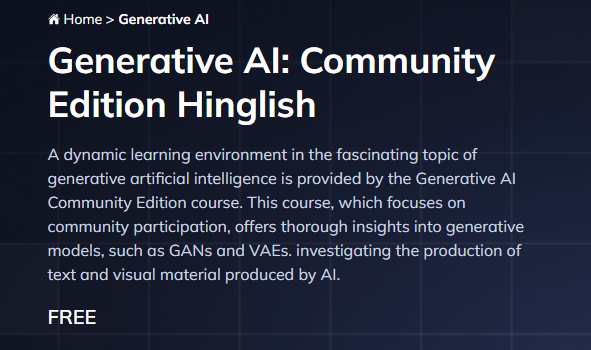

# 2024年学习生成式人工智能的路线图

## 先决条件

## 1. Python编程语言 - 1个月
#### Python:

1. 完成英文的Python播放：

1. Flask播放：

1. Fast API教程：

## 2. 基本的机器学习自然语言处理（第1天 - 第5天）
1. 为什么需要自然语言处理(NLP)？
2. One-hot编码，词袋模型(One hot Encoding, Bag Of Words)
3. TFIDF
4. Word2Vec，AvgWord2Vec

## 3. 基本的深度学习概念（第1天 - 第5天）

1. 人工神经网络（ANN）- 多层神经网络的工作原理
2. 前向传播，反向传播(Forward Propogation, Backward Propogation)
3. 激活函数，损失函数(Activation Functions, Loss Functions)
4. 优化器(Optimizers)

## 4. 高级的自然语言处理概念（第6天 - 最后一节视频）
1. 循环神经网络（RNN), LSTM RNN
2. GRU RNN 循环神经网络
3. 双向LSTM循环神经网络（Bidirection LSTM RNN）
4. 编码器-解码器模型、注意力机制、序列到序列模型（Encoder Decoder, Attention is all you need ,Seq to Seq）
5. Transformers模型

## 5. 开始迈向生成式人工智能之旅（GPT4、Mistral 7B、LLAMA、Hugging Face开源LLM模型、Google Palm模型）

1. OpenAI  

2. Langchain带项目的教程  

3. Chainlit 
4. Google Gemini 

## 5. 向量数据库和向量存储

1. ChromaDB
2. 基于Facebook AI相似性搜索（FAISS）库的FAISS向量数据库
3. 基于Lance数据格式的LanceDB向量数据库
4. 用于存储向量的Cassandra数据库

## 6. 部署LLM项目

1. AWS
2. Azure
3. LangSmith
4. LangServe
5. HuggingFace Spaces

## iNeuron免费社区生成式人工智能系列课程 

请注意，上述路线图仅供参考，旨在帮助您学习生成式人工智能。您可以根据自己的兴趣和需求进行适当的调整和扩展。